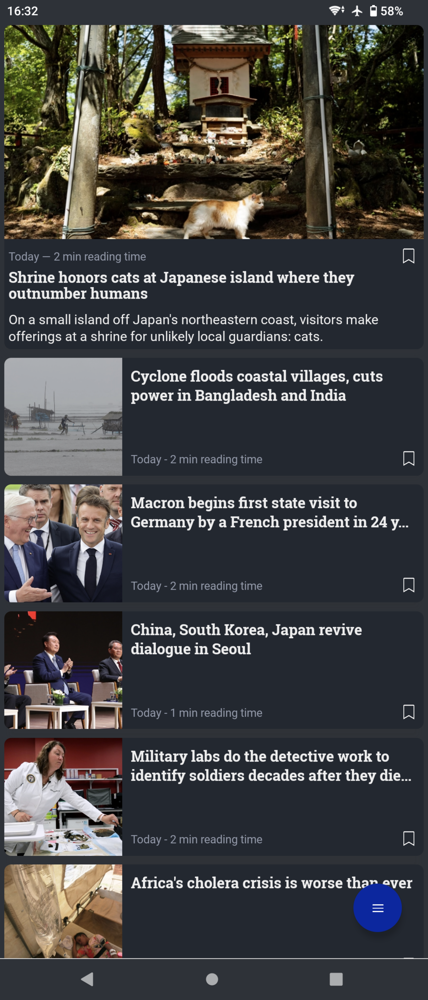
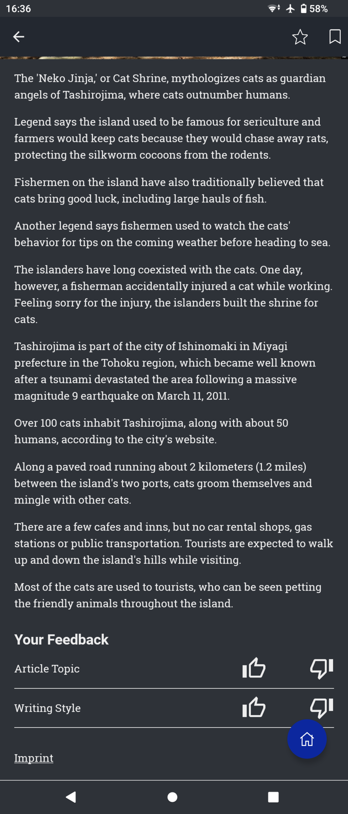
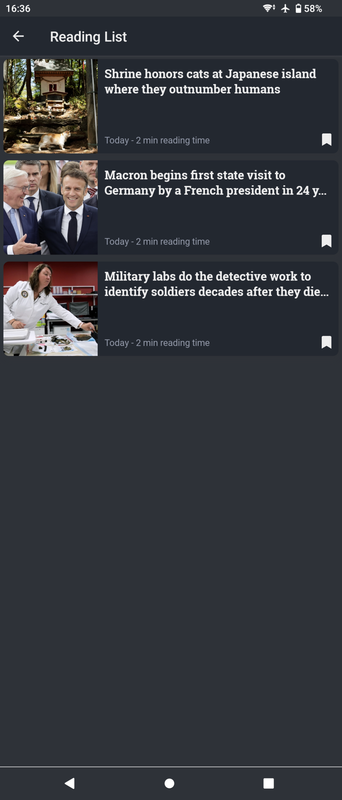
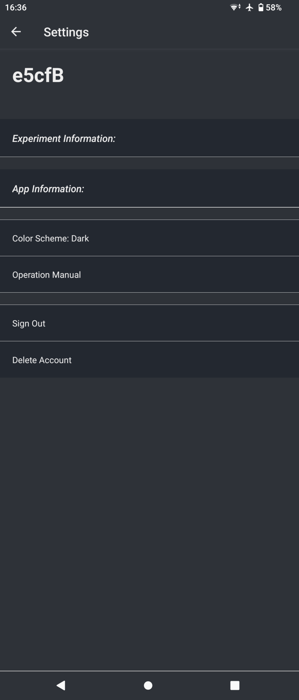
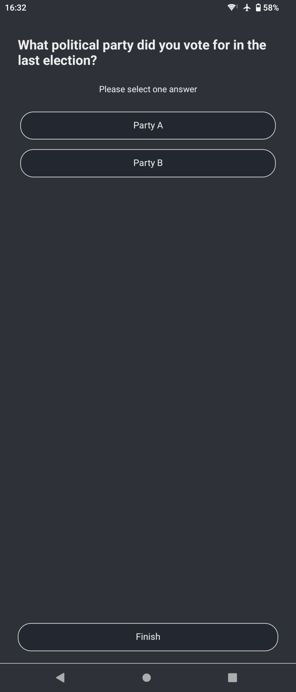

Mobile App
==========

The screenshots below show how the app presents itself to the users and how the content is rendered on screen.
The UI has additional light/dark mode features, can scale content and supports swipe commands (all screenshots are taken from an Android device with the dark mode enabled).

.. note::

   Please note that the user interface here is multi-lingual, reading out the default language of the device the app is installed on.
   All interface labels can customized.
   The language of the provided content of course, depends on what the researchers upload to the database and is unaffected by any regional/language settings.

Home Screen
-----------

The home screen features the feed/overview of all the content for our sample user.
It can be fully personalized.
For each item, two different preview modes are available (e.g., top screen-wide preview vs. the other square thumbnail item previews below).
Furthermore, the home screen allows items to be bookmarked and consumed later on.
Selecting any item will then bring the user to the next screen, the detail view (here, article view).

Article View
------------

By selecting an item from the feed, the user then gets to the detail view.
Here, they are able to look at the full content of the item and leave a rating.
They are also able to add items to their favorite list and/or bookmark it to consume it later on.

.. image:: img/app_screenshots/app_screenshots_2.png
   :height: 720
   :alt: Article view

Article Rating
--------------

The app allows each user to react and rate the item recommendations they are provided with.
On the bottom of each item, there is a thumbs up and thumbs down icon (see the below picture on the left and center).
In addition to expressing their like or dislike of a certain item, experimenters can choose to either enable or disable a rating survey.
This survey allows users to further specify what the exact reasons were of why they liked or disliked a certain item recommendations.

Favorite/Bookmark List
----------------------

Bookmarking or favoriting an item creates a new entry in a separate bookmark/favorite list.
Both lists look identical.
They can be accessed via the main menu (blue button in the bottom right-hand corner).

Settings Menu
-------------

The app features a settings menu where researchers can post additional information about the experiment.
Researchers can link the *Privacy Policy*, *Terms and Conditions*, a experiment website, support e-mail, and general information about the user study in a free text field.
In this menu, users are also able to request the account deletion (this is a new requirement from Google and Apple).
By default, users are forwarded to a separate URL where they can enter their username.
This is then sent to the e-mail address of the responsible researcher.

In-app Survey
-------------

The app allows experimenters to display surveys at any point in time. A wide range of different question types are supported.
Below is an overview of how the questions are presented to the participants and what the available options are.

