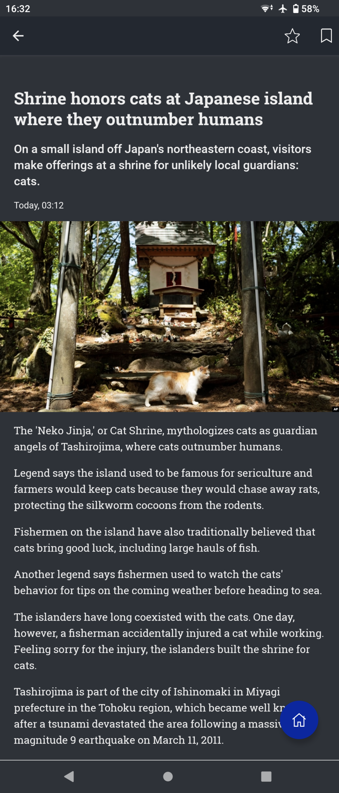

Mobile App
==========

The screenshots below show how the app presents itself to the users and how the content is rendered on screen.
The UI features additional light/dark mode options, can scale content, and supports swipe commands (all screenshots were taken from an Android device with dark mode enabled).

.. image:: gif/animation.gif
   :height: 720
   :alt: App animation

.. note::

   Please note that the user interface is multi-lingual, displaying the default language of the device on which the app is installed.
   All interface labels can be customized.
   The language of the provided content, of course, depends on what the researchers upload to the database and is unaffected by any regional/language settings.

Home Screen
-----------

The home screen features the feed/overview of all the content for our sample user.
It can be fully personalized.
For each item, two different preview modes are available (e.g., top screen-wide preview vs. the other square thumbnail item previews below).
Furthermore, the home screen allows users to bookmark and access items later on.
Selecting any item will then direct the user to the next screen, the detail view (in this case, the article view).

.. image:: img/screenshots_app/app_screenshots_1.png
   :height: 720
   :alt: Home screen

Article View
------------

By selecting an item from the feed, the user then gets to the detail view.
Here, they can view the full content of the item and leave a rating.
They are also able to add items to their favorite list and/or bookmark them to consume later.

Article Rating
--------------

The app allows each user to react to and rate the item recommendations they receive.
At the bottom of each item, there are thumbs-up and thumbs-down icons (see the picture below on the left and center).
In addition to expressing their like or dislike of a certain item, experimenters can choose to either enable or disable a rating survey.
This survey enables users to provide more detailed reasons for their liking or disliking of a specific item recommendation.

.. image:: img/screenshots_app/app_screenshots_3.png
   :height: 720
   :alt: Article rating

Favorite/Bookmark List
----------------------

Bookmarking or favoriting an item creates a new entry in a separate bookmark/favorite list.
Both lists look identical.
They can be accessed via the main menu (blue button in the bottom right-hand corner).

.. image:: img/screenshots_app/app_screenshots_4.png
   :height: 720
   :alt: Favorite and bookmark list

Settings Menu
-------------

The app features a settings menu where researchers can post additional information about the experiment.
Researchers can link the *Privacy Policy*, *Terms and Conditions*, an experiment website, support email, and general information about the user study in a free-text field.
Furthermore, users can access the built-in tutorial under *Operational Manual* to learn how to navigate and use the app.
In this menu, users can also request account deletion (this is a new requirement from Google and Apple).
By default, users are forwarded to a separate URL where they can enter their username.
This is then sent to the e-mail address of the responsible researcher.

.. image:: img/screenshots_app/app_screenshots_5.png
   :height: 720
   :alt: Settings menu

In-app Survey
-------------

The app allows experimenters to display surveys at any point in time. A wide range of different question types is supported.
Below is an overview of how the questions are presented to participants and the available options.

.. image:: img/screenshots_app/app_screenshots_6.png
   :height: 720
   :alt: In-app survey
