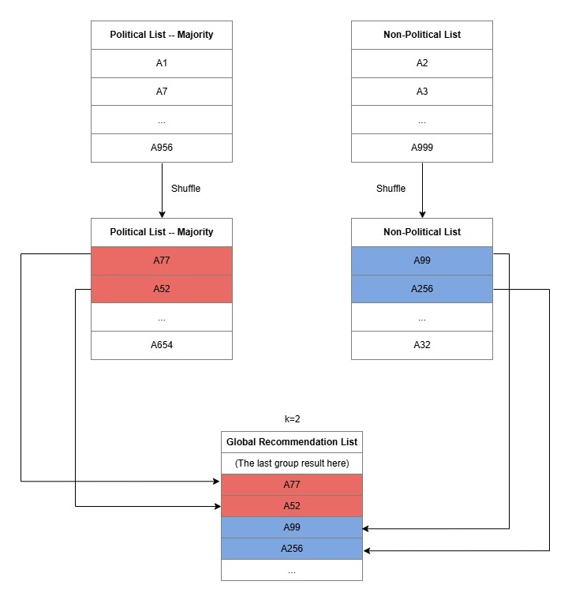

Deliberative Diversity
======================

The deliberative ``Exposure Diversity`` (EPD) is an algorithm that implements a deliberative diversity model by providing news articles from a wide range of topics and viewpoints.
EPD emphasizes party visibility, particularly of minority parties, to enhance public awareness and to foster a more inclusive understanding of political discourse.

For the code, please see the `EPD implementation <https://github.com/Informfully/Recommenders/tree/main/cornac/models/epd>`_ in the repository.

.. note::

  This tutorial outlines part of the workflow for the `Informfully Recommenders <https://github.com/Informfully/Recommenders>`_ repository.
  The `Recommenders Pipeline <https://informfully.readthedocs.io/en/latest/recommenders.html>`_ provides an overview of all components.
  And you can look at the `Tutorial Notebook <https://github.com/Informfully/Experiments/tree/main/experiments/tutorial>`_ for hands-on examples of everything outlined here.

Algorithm Overview
------------------

EPD is based on the articles of the majority party and the minority party, and the user's attributes.
It requires researchers to pre-configure the party attributes and the user's political type.
To that end, EPD assigns users to one of three conditions at the beginning of an experiment:
1. exposed to news on the majority parties, 
2. exposed to minority party news, or 
3. exposed to other political news.
The Figure below shows an overview of how EPD builds the recommendation list one slide at a time.

The continuous exposure length of majority party articles and minority party articles, political articles, and non-political articles is controlled by parameters to increase the diversity of recommendation results.
In each news recommendation list, articles with majority and minority views are displayed in the order of the interval set by the user.
E.g., with a list size of 20 and a slice value of 2, users in the minority party condition receive two minority party articles, followed by two non-political articles.
This is repeated until 20 articles are added to the feed.
The news supply to EPD assumes items are from the most recent day.
Articles get shuffled before being added to a recommendation list.
This is done to avoid any outlet-based clustering, as articles are scraped one outlet at a time.

Open Parameters
---------------

Details can be found in the `Configuration File <https://github.com/Informfully/Recommenders/blob/main/tests/configs/model_configs/parameters.ini>`_.

* name: string, default: 'EPD'. The name of the recommender model.
* articles_collection: list. The list of whole articles, with the article's political reference.
* political_type_dict: dict. The dictionary of political classes, keys are indices, values are political types of articles.
* num_items: int. The number of items(here are articles) in one experiment.
* k: int, optional, default: 3. The number of political and non-political articles each time added into recommendation collection.
* pageWidth: int, optional, default: 24. The maximum number of articles added for each user group.
* trainable: boolean, optional, default: True. When False, the model is not trained, and Cornac assumes that the model is already pre-trained. (U and V are not 'None'.)
* verbose: boolean, optional, default: False.When 'True', running logs are displayed.

Article Classification
----------------------

Articles in the majority party's news must mention at least one majority/governing party, and they must not mention any minority or opposition party.
Minority party news features at least one minority/opposition party.
Other political news consists of articles on political topics, not mentioning any majority or minority parties or mentioning foreign political parties.
The list size of EPD determined the number of recommended articles, with a slice value used for grouping and interleaving non-political articles.

Source
------

`Deliberative Diversity for News Recommendations - Operationalization and Experimental User Study <https://dl.acm.org/doi/10.1145/3604915.3608834>`_, Heitz *et al.*, Proceedings of the 17th ACM Conference on Recommender Systems, 813–819, 2023.

.. code-block:: console

   @inproceedings{heitz2023deliberative,
      title={Deliberative Diversity for News Recommendations: Operationalization and Experimental User Study},
      author={Heitz, Lucien and Lischka, Juliane A and Abdullah, Rana and Laugwitz, Laura and Meyer, Hendrik and Bernstein, Abraham},
      booktitle={Proceedings of the 17th ACM Conference on Recommender Systems},
      pages={813--819},
      year={2023}
   }
