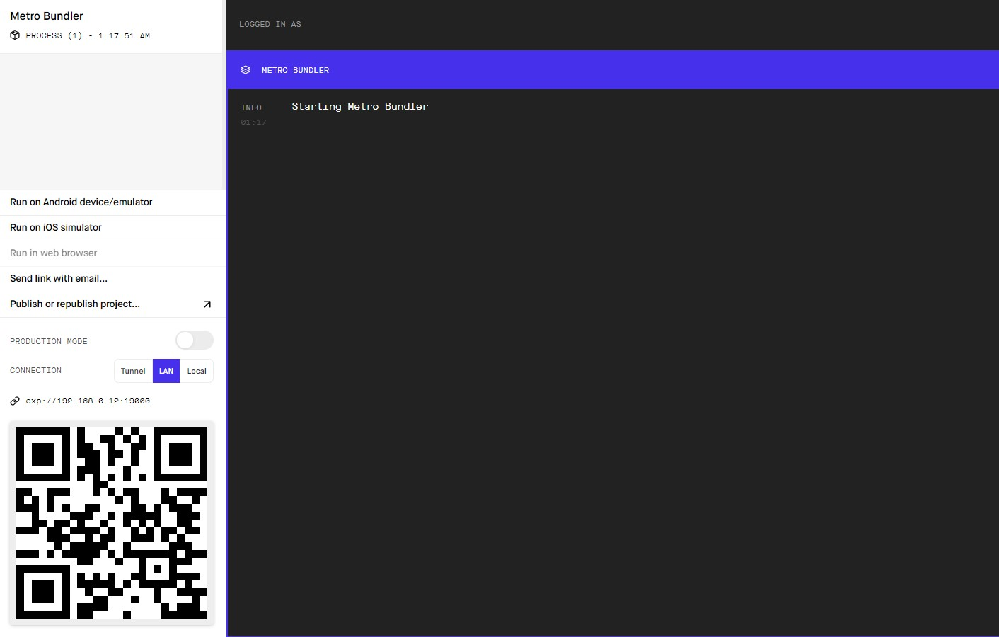

Local Development
=================

This tutorial guides you through running the application with a local server for development and testing purposes.
There two seperate components that need to be set up, the **front end ** and the **back end**.
You will need to install the following libraries and packages on your machine:

* `Meteor <https://docs.meteor.com/install.html>`_. The globally installed Meteor version does not matter, as the project will use the project-specific one defined in ``./backend/.meteor/release`` (located `here <https://github.com/Informfully/Platform/blob/main/backend/.meteor/release>_, currently 2.14`_).
* XCode (macOS only) for iOS development and Android Studio for Android development.
* `Node.js <https://nodejs.org/>`_ Version **16**.
* `Yarn <https://classic.yarnpkg.com/lang/en/docs/install/>`_ Version **1.22 or higher**.
* `npm <https://docs.npmjs.com/downloading-and-installing-node-js-and-npm>`_ Version **8.1 or higher**.

To check whether you already have them installed, simply check the version in a terminal:

.. code-block:: console
    
    # check whether Meteor installed and in PATH
    meteor --version

    # check whether Node installed and in PATH
    node -v

    # check whether npm installed and in PATH
    npm -v

    # check whether yarn installed and in PATH
    yarn --version

Also, do not forget that it is best if your development and production environment have the same package versions (meaning that the libraries on the deployment server for the `website and back end <https://informfully.readthedocs.io/en/latest/deployment.html>`_ and `Docker container setup <https://informfully.readthedocs.io/en/latest/docker.html>`_ should also be updated).

Running a Local Server
----------------------

Using ``meteor npm install`` is the preferred way of installing new dependencies for the Meteor back end.

.. code-block:: python

    # Download the source code
    git clone https://gitlab.ifi.uzh.ch/ddis/Students/Projects/2023-news-app.git

    cd backend

    # Install all packages
    meteor npm install

To start the back end on your machine:

.. code-block:: console

    # To runs the server on port 3008 with settings configured for the development environment...
    ./meteor-start.sh

    # ...and...
    bash meteor-start.sh

    # ...or alternatively by specifying --port directly to run the server by
    meteor --port 3008 --settings settings-dev.json

If you want to access the server from within your network replace ``--port 3008`` with ``--port <your local ip>:3008``.
The back end is now running and the administration website is accessible at the URL ``localhost:3008``.

.. note::

    **Database Setup** You can connect to the database through ``mongodb://localhost:3009/`` if your Meteor server is running on port 3008.
    If the users collection in the database is empty when starting up, a new user with Maintainer role is created automatically by the genesis.js script <located `here <https://informfully.readthedocs.io/en/latest/genesis.html>`_>.

Connecting to Local Server
--------------------------

Inside the ``App.js configuration file`` (located `here <https://github.com/Informfully/Platform/blob/main/frontend/App.js>`_), change the ``SERVER`` constant so it will connect to your local server.
E.g., if the client runs on the same computer:

.. code-block:: javascript

    const SERVER = 'localhost'

If you want to use your client on a different computer in the same network, replace ``localhost:3008`` with ``<TARGET>:3008``.

After you have set the ``SERVER`` constant, you can do the following to start the client:

.. code-block:: console

    # Go to front end directory
    cd frontend

    # Install all packages
    yarn install 

    # start expo
    npx expo start

.. note::

    **Important** ``npx`` comes with ``npm`` and hence with ``Node.js``. ``npm`` will automatically fetch ``Expo``. If prompted, install ``npx`` and/or ``expo`` as required.

Afterwards, you can scan the QR code that will show up, if you want to test the app on a physical device (recommended).
Or you can connect to a device emulator/simulator (e.g., Android Studio or XCode).

The app will run in the `Expo Go App <https://expo.dev/client>`_ and any changes to the source code will be automatically reflected in Expo Go.
