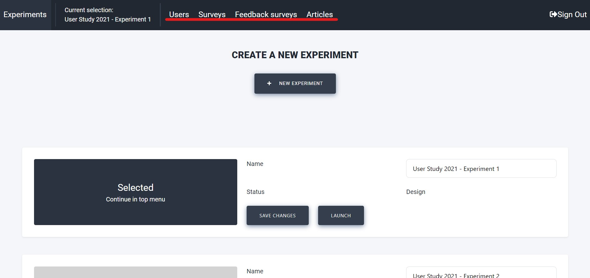

Experiment Workflow
===================

Launching an experiment assumed you already have the apps published, the website launched, and the back end server running.
If this is not the case, please go back to the `Installation Instructions <https://informfully.readthedocs.io/en/latest/install.html>`_ and follow the tutorial step-by-step.

This site presents an overview of how to make use of the Informfully Platform.
The entire system is organized on the basis of experiments.
Participants get access to the app by being assigned to a given experiment/research project.
Depending on the group a participant is assigned to, the app can present them with unique, group-specific content.

This content (text, video and audio) can be freely accessed and rated by the user.
The following guidelines provide a detailed overview of how to setup and configure such experiments.
A sample experiment of launching Informfully as a news recommendations platform will be used as example to guide through each of the experiment's phases.

.. image:: img/tutorial_screenshots/experiment_cycle.png
   :width: 700
   :alt: Overview of the phases of a user experiment

Experiment Setup
----------------

The ``Exeriments`` screen where you manage your experiments.
You can create multiple experiments and run them simultaneously with completely separate participants and surveys.

To create a new experiment, click on the ``NEW EXPERIMENT``-button.
An overlay with a form will show up where you can type in a name for the new experiment.
After pressing ``CREATE EXPERIMENT``, you will see the new experiment on the screen.
On the right, the name can be changed by editing the text field and clicking the ``SAVE CHANGES``-button.

The initial experiment status is ``DESIGN``.
In this stage, the administrator can add users, change the surveys and experiment with the setup.
Once the status is switched to ``LAUNCHED`` by clicking the button, the settings of the experiment are locked to preserve the integrity of the results.

Select/Deselect an experiment by clicking on the large button on the left.
Once an experiment has been selected, the tabs in the top menu bar are revealed (menu may be hidden behind a menu icon on smaller screens).
The tabs in the top menu bar are described in the subsections below.

.. note::

    Except through the tabs in the top menu bar, further experiment-specific configurations can be made directly over the MongoDB (check `Database Collections <https://informfully.readthedocs.io/en/latest/database.html>`_).

User Creation
-------------

Once an experiment is selected in the ``Experiments`` screen, the participants of that experiment will be listed on the ``Users`` screen.
Find out more aboute `User Creation <https://informfully.readthedocs.io/en/latest/users.html>`_.

If the experiment is new, new users can be added by pressing ``ADD USERS``. 
Another module will appear with a form, where the user amount and the user group can be specified.
The user group can be any text to discern participants into groups (e.g. ``baseline`` and ``experimental``).
After submitting, the users should immediately show up in the list.
The new users are created with randomized usernames and passwords.
The passwords can be accessed by exporting a CSV file by pressing the ``CSV EXPORT``-button.
A download prompt will pop up.

.. image:: img/tutorial_screenshots/tutorial_2.jpg
   :width: 700
   :alt: Users screen

Each individual user can be deleted by clicking the trashcan on the right of the row.
We recommend exporting the user accounts as CSV and to make a backup copy.
(E.g., for support purposes, in case users forget their password.)

Survey Questions
----------------

Informfully has a built-in `Survey Tool <https://informfully.readthedocs.io/en/latest/surveys.html>`_.
It allows researchers to easily create and send out surveys within one seamless interface.
Please read the above entry on the details and functionalities of this survey tool.

We do understand that not ever use case will require surveys.
It is for this reason that the inclusion of user surveys is an optional component.
Researchers can skip this step is there is no requirement of getting user feedback.

Additionally, rating surveys/feedback can be defined as well.
``Feedback Surveys`` gives you the option to formulate statements about a news article, which every participant will see in the mobile application, positioned after a news article.
The participants can agree to (like) or disagree with (dislike) a statement.
The statements are the same for all the participants in an experiment.

Scraper Pipeline
----------------

In order to create recommendations for users, you first need to have items to recommend.
The item format is specified in the `Database Collections <https://informfully.readthedocs.io/en/latest/database.html>`_ (see ``newsArticles``, that serves as the item collection for the news aggregator use case in this online tutorial).

To populate this collection, we have provided a separate `Item Scraper <https://informfully.readthedocs.io/en/latest/scrapers.html>`_.
Please read the documentation on how to deploy it.
The sourcode is available for download in the `Scrapers Repository <https://github.com/Informfully/Scrapers>`_.

.. image:: img/tutorial_screenshots/tutorial_4.jpg
   :width: 700
   :alt: Items screen

We recommend running the scrapers on the same server as the other parts of the back end.
There is no communication happening between the scraping modules and any other component of Informfully.
You can set the scraper up in such a way that they write directly to MongoDB's document collection ``newsArticles``/``itemCollection``.

Recommender System
------------------

By default, all items in  ``newsArticles``/``itemCollection`` will be shown in chronological order.
However, there is the option to connect an external recommender system framework to the Informfully back end in order to have rankes user recommendations.

To have user receive personalized recommendations, the collection ``recommendationLists`` (see `Database Collections <https://informfully.readthedocs.io/en/latest/database.html>`_) needs to be populated.

Below this paragraph is reference implementation of how to create a single user recommendations.
(We advise using the official package for creating ``ObjectId``-records).

.. code-block:: python

    from bson.objectid import ObjectId

    # Create a singla recommendation for a user in the JREX format
    def create_recommendation(user, article_id, prediction, algorithm_id, preview):

        recommendation = {
            "_id": ObjectId(),
            "userId": user,
            "articleId": article_id,
            "prediction": prediction,
            "recommendationAlgorithm": algorithm_id,
            "isPreview": preview,
            "createdAt": datetime.now()
        }

        return recommendation

The implementation of the recommendation list is framework-agnostic.
All that is needed it to write this data to ``recommendationLists`` in MongoDB.
Researchers can put this behind their own API or they can run the recommender system on the same back end server as the other components of Informfully (thus directly writing to the database).

Launch Experiment
-----------------

Once all the previous steps have been completed, the Informfully instance is ready to host and launch user experiments.
You can go back to the experiment overview page and set the mode to ``LAUNCH``.
