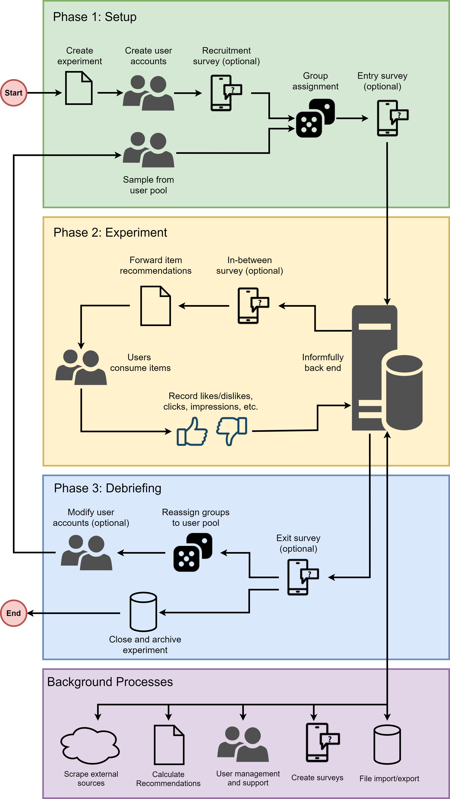

Experiment Workflow
===================

Launching an experiment assumed you already have the apps published, the website launched, and the back end server running.
If this is not the case, please go back to the `Installation Instructions <https://informfully.readthedocs.io/en/latest/install.html>`_ and follow the tutorial step-by-step.

This site presents an overview of how to make use of the Informfully Platform.
The entire system is organized on the basis of experiments.
Participants get access to the app by being assigned to a given experiment/research project.
Depending on the group a participant is assigned to, the app can present them with unique, group-specific content.

This content (text, video and audio) can be freely accessed and rated by the user.
The following guidelines provide a detailed overview of how to setup and configure such experiments.
A sample experiment of launching Informfully as a news recommendations platform will be used as example to guide through each of the experiment's phases.

User Creation
-------------

...

Survey Questions
----------------

...

Scraper Pipeline
----------------

...

Recommender System
------------------

...

Start Experiment
----------------

...