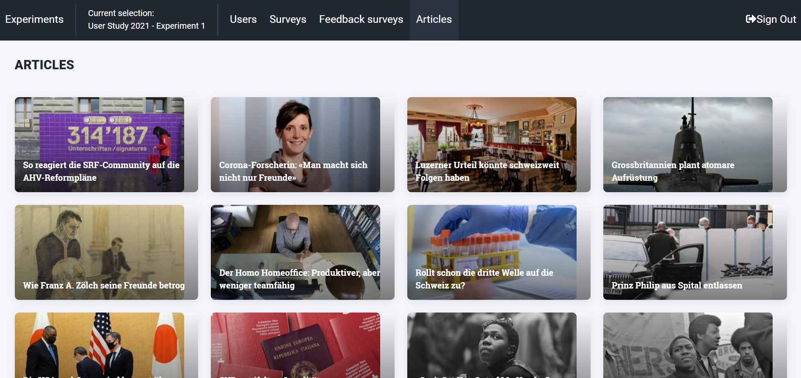

Experiment Workflow
===================

Launching an experiment assumed you already have the apps published, the website launched, and the back end server running.
If this is not the case, please go back to the `Installation Instructions <https://informfully.readthedocs.io/en/latest/install.html>`_ and follow the tutorial step-by-step.

This site presents an overview of how to make use of the Informfully Platform.
The entire system is organized on the basis of experiments.
Participants get access to the app by being assigned to a given experiment/research project.
Depending on the group a participant is assigned to, the app can present them with unique, group-specific content.

This content (text, video and audio) can be freely accessed and rated by the user.
The following guidelines provide a detailed overview of how to setup and configure such experiments.
A sample experiment of launching Informfully as a news recommendations platform will be used as example to guide through each of the experiment's phases.

.. _setup:

Experiment Setup
----------------

The ``Exeriments`` screen where you manage your experiments.
You can create multiple experiments and run them simultaneously with completely separate participants and surveys.

To create a new experiment, click on the ``NEW EXPERIMENT``-button.
An overlay with a form will show up where you can type in a name for the new experiment.
After pressing ``CREATE EXPERIMENT``, you will see the new experiment on the screen.
On the right, the name can be changed by editing the text field and clicking the ``SAVE CHANGES``-button.

The initial experiment status is ``DESIGN``.
In this stage, the administrator can add users, change the surveys and experiment with the setup.
Once the status is switched to ``LAUNCHED`` by clicking the button, the settings of the experiment are locked to preserve the integrity of the results.

Select/Deselect an experiment by clicking on the large button on the left.
Once an experiment has been selected, the tabs in the top menu bar are revealed (menu may be hidden behind a menu icon on smaller screens).
The tabs in the top menu bar are described in the subsections below.

.. image:: img/tutorial_screenshots/tutorial_1.jpg
   :width: 700
   :alt: Experiments screen

.. _users:

User Creation
-------------

Once an experiment is selected in the ``Experiments`` screen, the participants of that experiment will be listed on the ``Users`` screen.
Find out more aboute `User Creation <https://informfully.readthedocs.io/en/latest/users.html>`_.

If the experiment is new, new users can be added by pressing ``ADD USERS``. 
Another module will appear with a form, where the user amount and the user group can be specified.
The user group can be any text to discern participants into groups (e.g. ``baseline`` and ``experimental``).
After submitting, the users should immediately show up in the list.
The new users are created with randomized usernames and passwords.
The passwords can be accessed by exporting a CSV file by pressing the ``CSV EXPORT``-button.
A download prompt will pop up.

.. image:: img/tutorial_screenshots/tutorial_2.jpg
   :width: 700
   :alt: Users screen

Each individual user can be deleted by clicking the trashcan on the right of the row.
We recommend exporting the user accounts as CSV and to make a backup copy.
(E.g., for support purposes, in case users forget their password.)

.. _surveys:

Survey Questions
----------------

Informfully has a built-in `Survey Tool <https://informfully.readthedocs.io/en/latest/surveys.html>`_.
It allows researchers to easily create and send out surveys within one seamless interface.
Please read the above entry on the details and functionalities of this survey tool.

We do understand that not ever use case will require surveys.
It is for this reason that the inclusion of user surveys is an optional component.
Researchers can skip this step is there is no requirement of getting user feedback.

.. image:: img/tutorial_screenshots/tutorial_1.jpg
   :width: 700
   :alt: Surveys screen

Additionally, rating surveys/feedback can be defined as well.
``Feedback Surveys`` gives you the option to formulate statements about a news article, which every participant will see in the mobile application, positioned after a news article.
The participants can agree to (like) or disagree with (dislike) a statement.
The statements are the same for all the participants in an experiment.

.. _scrapers:

Scraper Pipeline
----------------

In order to create recommendations for users, you first need to have items to recommend.
The item format is specified in the `Database Collections <https://informfully.readthedocs.io/en/latest/database.html>`_ (see ``newsArticles``, that serves as the item collection for the news aggregator use case in this online tutorial).

To populate this collection, we have provided a separate `Item Scraper <https://informfully.readthedocs.io/en/latest/scrapers.html>`_.
Please read the documentation on how to deploy it.
The sourcode is available for download in the `Scrapers Repository <https://github.com/Informfully/Scrapers>`_.

We recommend running the scrapers on the same server as the other parts of the back end.
There is no communication happening between the scraping modules and any other component of Informfully.
You can set the scraper up in such a way that they write directly to MongoDB's document collection ``newsArticles``/``itemCollection``.

.. _recommender:

Recommender System
------------------

By default, all items in  ``newsArticles``/``itemCollection`` will be shown in chronological order.
However, there is the option to connect an external recommender system framework to the Informfully back end in order to have rankes user recommendations.

To have user receive personalized recommendations, the collection ``recommendationLists`` (see `Database Collections <https://informfully.readthedocs.io/en/latest/database.html>`_) needs to be populated.

Below this paragraph is reference implementation of how to create a single user recommendations.
(We advise using the official package for creating ``ObjectId``-records).

.. code-block:: python

    from bson.objectid import ObjectId

    # Create a singla recommendation for a user in the JREX format
    def create_recommendation(user, article_id, prediction, algorithm_id, preview):

        recommendation = {
            "_id": ObjectId(),
            "userId": user,
            "articleId": article_id,
            "prediction": prediction,
            "recommendationAlgorithm": algorithm_id,
            "isPreview": preview,
            "createdAt": datetime.now()
        }

        return recommendation

The implementation of the recommendation list is framework-agnostic.
All that is needed it to write this data to ``recommendationLists`` in MongoDB.
Researchers can put this behind their own API or they can run the recommender system on the same back end server as the other components of Informfully (thus directly writing to the database).

.. _experiment:

Launch Experiment
-----------------

Once all the previous steps have been completed, the Informfully instance is ready to host and launch user experiments.
You can go back to the experiment overview page and set the mode to ``LAUNCH``.
Once launched, it will follow the typical experimentation cycle described below:

.. image:: img/tutorial_screenshots/experiment_cycle.png
   :width: 700
   :alt: Overview of the phases of a user experiment

**Phase 1 - Enrollment Phase**

Participants download the app from the respective storefronts (**Android** or **iOS**).
Once the app is installed, users sign in using either experiment-specific credentials that were provided to them or they create a new account.
(User credentials/accounts can be generated in batches when setting up an experiment.

In a subsequent step, users can be prompted an intake survey to create a detailed user profile.
(Please note that this is an optional step.)
The intake survey is not restricted to any specific type of question.
Additional surveys can be displayed at any point in time.
They can be made mandatory, so that a user needs to fill in all questions before they can continue using the app.
The answers to each survey will be stored separately. (See [User Surveys](User Surveys) for further details.)

All answers to the survey will be automatically stored in the database under the associated experiment for any given user.
There is no restriction on how many surveys a user is required/able to take at any given moment.
Furthermore, it is possible to have a script running on the server that takes the survey answers of a person or an entire group as input to calculate some additional user profile values (e.g., political scores), which will be automatically added to the database.

Once user accounts are being created, they can be separated into specific user groups.
Each user has to be part of one group (and one experiment) at each point in time. Access to the app can be enabled or revoked instantaneously via this group membership; temporal restrictions can be placed as well.

**Phase 2 - Experiment Phase**

Once users are assigned to their respective groups they can be presented with group-specific content.
This content can be text, video or audio. All content is stored in a schema-free MongoDB instance.
Content can be copied to the database before the start of the experiment or it can be added/expanded at any future point in time.
In the sample above, we see how a cron job regularly scrapes online websites to add new items to the central database for recommendation purposes.

Assigning content to participants in the groups of an experiment can be done simultaneously (everyone gets to see the content at the same point in time) or it can be stacked (groups receive content one after the other or in any custom fashion that can be controlled via a script).
The example above shows one possible three-step process of how a stacked content assignment pipeline could look like.
News articles are used as an example, but the content of the item can be any kind of text, video or audio.

In the example shown, we see that in a first step the baseline group gets to read and rate news articles.
In a second step, the recommender system on the server calculates two different item recommendation for the next two groups.
The third and last step consists of pushing these items into the news feeds of the subsequent two groups and then again records all their interaction metrics.

Looking at the pipeline in more detail, the app offers the possibility to assign content either in a static or a dynamic fashion.
A static fashion would be that the researchers define beforehand the exact items a user gets to see.
A dynamic fashion means that there is some script in place that calculates item recommendations.

**Phase 3 – Debriefing Phase**

Each experiment session should end with a debriefing survey.
The debriefing survey can be combined with an event trigger that automatically blocks further access to the app, or access can be revoked at a specific time in the future.

After completion of the experiment, any of the recorded data points can be exported as either **CSV** or **JSON**.
Since the app is using MongoDB for the database part, it is also possible to export or create a separate instance with copies of all collections/documents for further analysis and evaluation purposes.
