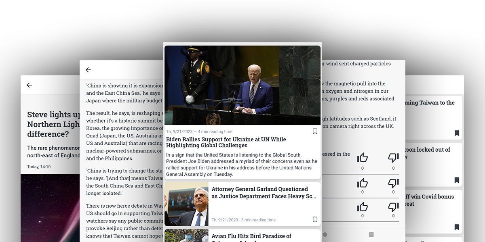

Informfully
===========

**Informfully** is a open-source reproducibility platform for content distribution and conducting user experiments.
Please visit the official `Informfully website <https://www.informfully.ch>`_ for more information.

This is combined and official Informfully Documentation for all `code repositories <https://github.com/orgs/Informfully/repositories>`_.
For a tutorial on how to use Informfully, start with the :doc:`setup` section and the :ref:`installation` instructions for the project.

Overview
--------

**Getting Started** serves as the introduction to download and install the platform on your local machine.
**General Information** outlines the various components and how/where you need to adjust things to make Informfully fit your needs.
**Mobile App** and **Administration Website** provide a in-depth overview of the front end.
**Database and Back End** provide the same insights for the back end components.
Finally **Deployment** looks at how to move the back end to a server and how to publish the apps on the storefronts.

.. note::

   This project is under active development.

.. toctree::
   :maxdepth: 1
   :caption: Getting Started

   install
   quick-front
   quick-back
   development

.. toctree::
   :maxdepth: 1
   :caption: General Information

   architecture
   experiment

.. toctree::
   :maxdepth: 1
   :caption: Mobile App

   app

.. toctree::
   :maxdepth: 1
   :caption: Administration Website

   web

.. toctree::
   :maxdepth: 1
   :caption: Database and Back End

   database
   genesis
   scrapers

.. toctree::
   :maxdepth: 1
   :caption: Deployment

   docker
   deployment
   google
   apple

Citation
--------

If you use any Informfully code/repository in a scientific publication, we ask you to cite the following papers:

* `Deliberative Diversity for News Recommendations - Operationalization and Experimental User Study <https://dl.acm.org/doi/10.1145/3604915.3608834>`_, Heitz *et al.*, Proceedings of the 17th ACM Conference on Recommender Systems, 813–819, 2023.

.. code-block:: console

   @inproceedings{heitz2023deliberative,
      title={Deliberative Diversity for News Recommendations: Operationalization and Experimental User Study},
      author={Heitz, Lucien and Lischka, Juliane A and Abdullah, Rana and Laugwitz, Laura and Meyer, Hendrik and Bernstein, Abraham},
      booktitle={Proceedings of the 17th ACM Conference on Recommender Systems},
      pages={813--819},
      year={2023}
   }

* `Benefits of Diverse News Recommendations for Democracy: A User Study <https://www.tandfonline.com/doi/full/10.1080/21670811.2021.2021804>`_, Heitz *et al.*, Digital Journalism, 10(10): 1710–1730, 2022.

.. code-block:: console

   @article{heitz2022benefits,
      title={Benefits of diverse news recommendations for democracy: A user study},
      author={Heitz, Lucien and Lischka, Juliane A and Birrer, Alena and Paudel, Bibek and Tolmeijer, Suzanne and Laugwitz, Laura and Bernstein, Abraham},
      journal={Digital Journalism},
      volume={10},
      number={10},
      pages={1710--1730},
      year={2022},
      publisher={Taylor \& Francis}
   }

Support
-------

Your are welcome to contribute to the Informfully ecosystem and become a part of your cummunity. Feel free to:

* fork any of the `Informfully repositories <https://github.com/Informfully/Documentation>`_ and
* make changes and create pull requests.

Please post your feature requests and bug reports in our `GitHub issues <https://github.com/Informfully/Documentation/issues>`_ section.

License
-------

Released under the `MIT License <https://github.com/Informfully/Documentation/blob/main/LICENSE>`_. (Please note that the respective copyright licenses of third-party libraries and dependencies apply.)

