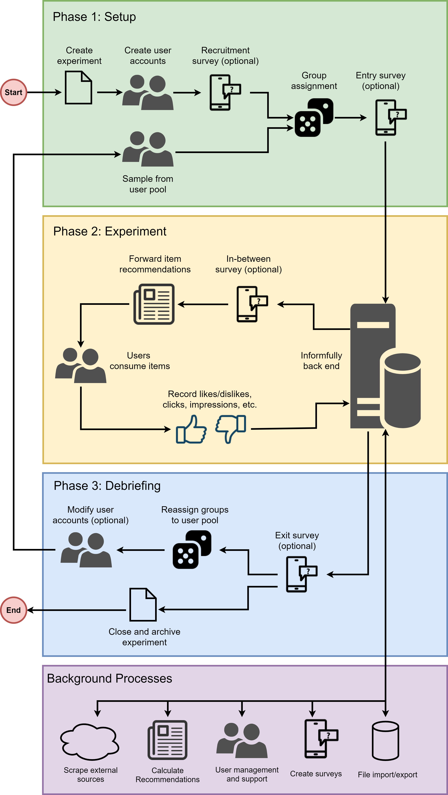

Experiment Overview
===================

This site presents an overview of user studies that were conducted with Informfully.
The entire platform is organized around experiments.
Participants get access to the app by being assigned to a given experiment/research project.

Depending on the group a participant is assigned to, the app can present them with unique, group-specific content.
This content (text, video and audio) can be freely accessed and rated by the user.
Once an experiment is launched, it will follow the typical experimentation cycle described below.

.. note::

   Please see the `Experiment Setup <https://informfully.readthedocs.io/en/latest/experiment.html>`_ for the tutorial on how to complete the project setup and how to launch a user experiment.

Phase 1 - Enrollment Phase
--------------------------

Participants download the app from the respective storefronts (**Android** or **iOS**).
Once the app is installed, users sign in using either experiment-specific credentials that were provided to them or they create a new account.
User credentials/accounts can be generated in batches when setting up an experiment.

In a subsequent step, users can be prompted to complete an intake survey to create a detailed user profile.
(Please note that this is an optional step.)
The intake survey is not restricted to any specific type of question.
Additional surveys can be displayed at any point in time.
They can be made mandatory, so a user needs to fill in all the questions before they can continue using the app.
The answers to each survey will be stored separately. (See `User Surveys <https://informfully.readthedocs.io/en/latest/surveys.html>`_ for further details.)

All answers to the survey will be automatically stored in the database under the associated experiment for any given user.
There is no restriction on how many surveys a user is required/able to take at any given moment.
Furthermore, it is possible to have a script running on the server that takes the survey answers of a person or an entire group as input to calculate some additional user profile values (e.g., political scores), which will be automatically added to the database.

Once user accounts are created, they can be separated into specific user groups.
Each user has to be part of one group (and one experiment) at each point in time. Access to the app can be enabled or revoked instantaneously via this group membership; temporal restrictions can be placed as well.

Phase 2 - Experiment Phase
--------------------------

Once users are assigned to their respective groups they can be presented with group-specific content.
This content can be text, video or audio. All content is stored in a schema-free MongoDB instance.
Content can be copied to the database before the start of the experiment or it can be added/expanded at any future point in time.
In the sample above, we see how a cron job regularly scrapes online websites to add new items to the central database for recommendation purposes.

Assigning content to participants in the groups of an experiment can be done simultaneously (everyone gets to see the content at the same point in time) or it can be stacked (groups receive content one after the other or in any custom fashion that can be controlled via a script).
The example above shows one possible three-step process of what a stacked content assignment pipeline could look like.
News articles are used as an example, but the content of the item can be any kind of text, video or audio.

In the example shown, we see that in the first step, the baseline group gets to read and rate news articles.
In a second step, the recommender system on the server calculates two different item recommendations for the next two groups.
The third and last step consists of pushing these items into the news feeds of the subsequent two groups, and then again recording all their interaction metrics.

Looking at the pipeline in more detail, the app offers the possibility to assign content either in a static or a dynamic fashion.
A static fashion would be that the researchers define beforehand the exact items a user gets to see.
A dynamic fashion means that there is some script in place that calculates item recommendations.

Phase 3 - Debriefing Phase
--------------------------

Each experiment session should end with a debriefing survey.
The debriefing survey can be combined with an event trigger that automatically blocks further access to the app, or access can be revoked at a specific time in the future.

After the completion of the experiment, any of the recorded data points can be exported as either **CSV** or **JSON**.
Since the app is using MongoDB for the database part, it is also possible to export or create a separate instance with copies of all collections/documents for further analysis and evaluation purposes.
