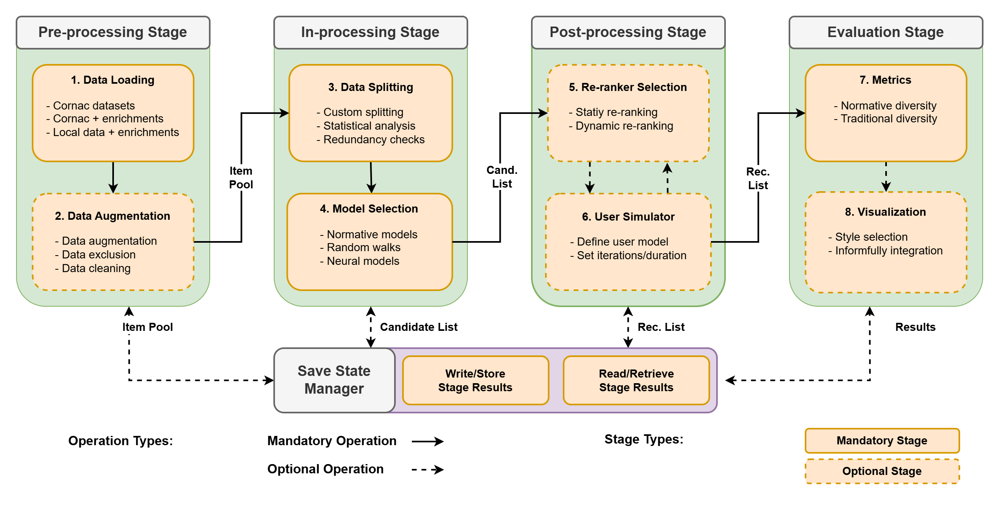

Recommender Pipeline
====================

This overview outlines the `Informfully Recommenders <https://github.com/Informfully/Recommenders>`_ repository. 
It can be used in combination with the Informfully Research Platfrom or in a stand-alone fashion.
Informfully Recommenders is an extension of `Cornac <https://github.com/PreferredAI/cornac>`_.
And you can look at the `Tutorial Notebook <https://github.com/Informfully/Experiments/tree/main/experiments/tutorial>`_ for hands-on examples of everything outlined here.

The diagram above shows the extendedn framework Informfully Recommenders provides.
It includes the four dedicated stages for pre-processing, in-processing, post-processing, and evaluation.
In addition to that, it features a save state manager where results of any stage can be stored and loaded (this allows re-using existing data, e.g., for applying different re-rankers to one and the same candidate list).
Please find below an outline of the individual components and a link to their dedicated pages to provide additional information.

1. Pre-processing Stage
-----------------------

* `Data loading <https://informfully.readthedocs.io/en/latest/loading.html>`_
* `Data augmentation <https://informfully.readthedocs.io/en/latest/augmentation.html>`_

2. In-processing Stage
----------------------

* `Data splitting <https://informfully.readthedocs.io/en/latest/splitting.html>`_ 
* Model Selection

  * `Participatory diversity <https://informfully.readthedocs.io/en/latest/participatory.html>`_
  * `Deliberative diversity <https://informfully.readthedocs.io/en/latest/deliberative.html>`_
  * `Random walks (RP3Beta and RWE-D) <https://informfully.readthedocs.io/en/latest/randomwalk.html>`_
  * `Diversity-driven random walk (D-RDW) <https://informfully.readthedocs.io/en/latest/drdw.html>`_
  * `Neural baselines <https://informfully.readthedocs.io/en/latest/neural.html>`_

3. Post-processing Stage
------------------------

* `Static re-rankers <https://informfully.readthedocs.io/en/latest/reranker.html>`_
* `Dynamic re-rankers <https://informfully.readthedocs.io/en/latest/dynamicreranker.html>`_

4. Evaluation Stage
-------------------------------------

* `Metrics assessment <https://informfully.readthedocs.io/en/latest/metrics.html>`_
* `Item visualization <https://informfully.readthedocs.io/en/latest/recommendations.html>`_
