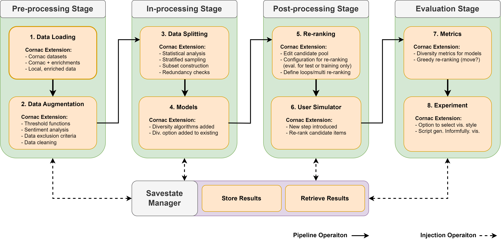

Recommender System
==================

This tutorial outlines the `Informfully Recommenders <https://github.com/Informfully/Recommenders>`_ repository. 
It can be used in combination with the Informfully platfrom or in a stand-alone fashion.

.. note::

  If you want to use the built-in Informfully Recommenders, please visit this `tutorial page <https://informfully.readthedocs.io/en/latest/compass.html>`_ instead.

Pipeline Overview
-----------------

* Pre-processing Stage
* In-processing Stage
* Post-processing Stage
* Evaluation Stage
* Savestate Manager

Work in progres...

1. Data Loading
---------------

`Data loading <https://informfully.readthedocs.io/en/latest/data.html>`_.

Work in progress...

2. Data Augmentation
--------------

`Data augmentation <https://informfully.readthedocs.io/en/latest/augmentation.html>`_.

Work in progress...

3. Data Splitting
--------------

`Data splitting <https://informfully.readthedocs.io/en/latest/splitting.html>`_.

Work in progress...

4. Models
--------------------

The ``Political Diversity`` algorithm is based on user scores and article scores.
The user score can be calculated from a questionnaire survey or based on the user's historical browsing data as adopted in this project, while the article score is calculated from the user scores of all its readers.
At the same time, the algorithm also requires a distribution to describe the number of articles that the system should recommend for a certain user score. 

The ``Exposure Diversity`` algorithm is based on the articles of the majority party and the minority party and the user's attributes.
It requires the user to pre-configure the party attributes and the user's political type (a random assignment strategy is adopted in this project, that is, randomly assigning a political type to the user).
The continuous exposure length of majority party articles and minority party articles, political articles and non-political articles is controlled by parameters to increase the diversity of recommendation results. 

For more information on the algorithms, please have a look at their dedicated pages:

* `Participatory diversity <https://informfully.readthedocs.io/en/latest/participatory.html>`_
* `Deliberative diversity <https://informfully.readthedocs.io/en/latest/deliberative.html>`_
* `Random walk (with popularity discount) <https://informfully.readthedocs.io/en/latest/randomwalk.html>`_
* `Diversity random walk (for political news) <https://informfully.readthedocs.io/en/latest/diversitywalk.html>`_

Work in progress...

5. Re-rankers
-------------

`Re-rankers <https://informfully.readthedocs.io/en/latest/reranker.html>`_.

Work in progress...

6. User Simulator
-----------------

`User simulator <https://informfully.readthedocs.io/en/latest/simulator.html>`_.

Work in progress...

7. Metrics
----------

`Metrics <https://informfully.readthedocs.io/en/latest/metrics.html>`_.

Work in progress...

8. Experiment
-------------

`Experiment (tutorial notebook) <https://informfully.readthedocs.io/en/latest/tutorial.html>`_.

Work in progress...

Savestate Manager
-----------------

* Storing results
* Retrieving results

Work in progres...
