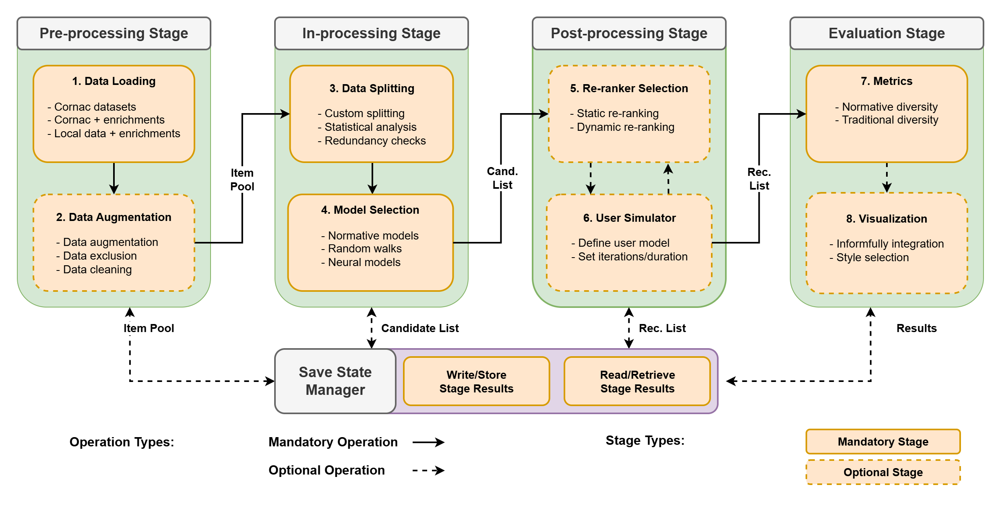

Recommender System
====================

This overview outlines the `Informfully Recommenders <https://github.com/Informfully/Recommenders>`_ repository. 
It can be used in combination with the Informfully Research Platform or in a stand-alone fashion.
Informfully Recommenders is an extension of `Cornac <https://github.com/PreferredAI/cornac>`_.
And you can look at the `Tutorial Notebook <https://github.com/Informfully/Experiments/tree/main/experiments/recsys_2025>`_ for hands-on examples of everything outlined here.

The diagram above shows the extended framework Informfully Recommenders provides.
It includes the four dedicated stages for pre-processing, in-processing, post-processing, and evaluation.
In addition to that, it features a save state manager where results of any stage can be stored and loaded.
This allows reusing existing data, e.g., for applying different re-rankers to one and the same candidate list.
Please find below an outline of the individual components and a link to their dedicated wiki pages for more information.

Pre-processing Stage
--------------------

* `Data Loading <https://informfully.readthedocs.io/en/latest/loading.html>`_
* `Data Augmentation <https://informfully.readthedocs.io/en/latest/augmentation.html>`_

In-processing Stage
-------------------

* `Data Splitting <https://informfully.readthedocs.io/en/latest/splitting.html>`_ 
* `Participatory Diversity <https://informfully.readthedocs.io/en/latest/participatory.html>`_
* `Deliberative Diversity <https://informfully.readthedocs.io/en/latest/deliberative.html>`_
* `Random Walks <https://informfully.readthedocs.io/en/latest/randomwalk.html>`_
* `Neural Baselines <https://informfully.readthedocs.io/en/latest/neural.html>`_

Post-processing Stage
---------------------

* `Re-rankers <https://informfully.readthedocs.io/en/latest/reranker.html>`_
* `User Simulator <https://informfully.readthedocs.io/en/latest/simulator.html>`_

Evaluation Stage
----------------

* `Metrics <https://informfully.readthedocs.io/en/latest/metrics.html>`_
* `Visualization <https://informfully.readthedocs.io/en/latest/recommendations.html>`_
