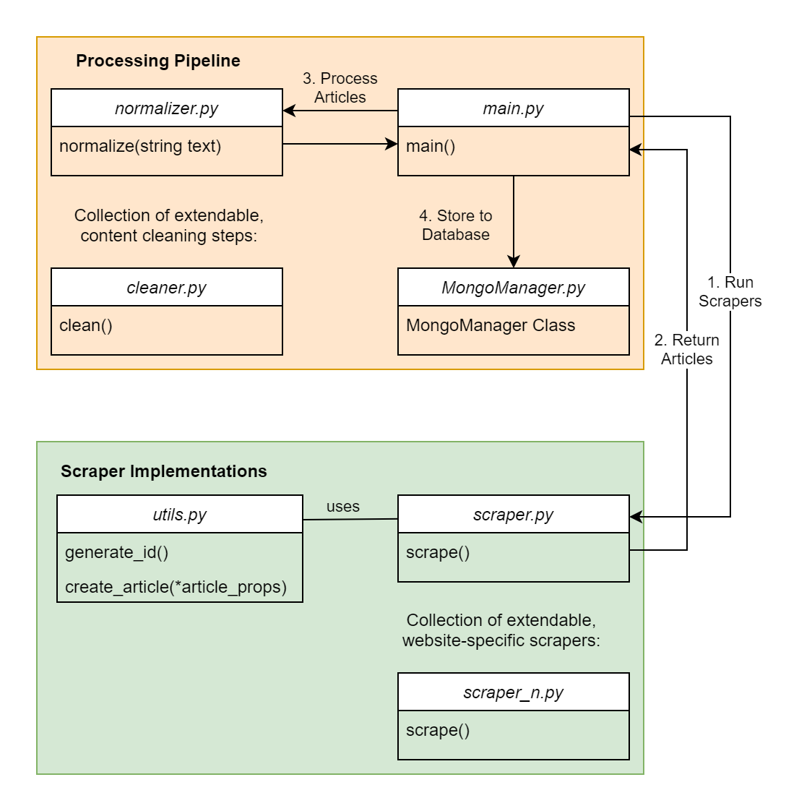

Scraper Pipeline
================

Informfully is complemented by a dedicated content scraper.
The entire content scraper pipeline is written in Python and uses MongoDB for persistent storage of news items.
The individual scraper modules (called `scrape.py` or `scrape\_n.py` in the Figure below) are required to implement a scraping function `scrape()`.
There are two main parts to the scraper.
The first part contains the scraper implementations that allow collecting/scraping online resources.
The second part is the processing pipeline for text normalization, cleaning, and subsequent steps before storing them in the database.

Despite the goal of the scrapers being the same for all outlets, the different formats, types of sources of information, and paywalls on news outlets rendered the task of having only one scraper very challenging
Hence, the decision was made to have split scrapers, where one part consists of shared core functionalities of parsing HTML, and a second part of adjusting to particular news outlets.
Specifically, the scrapers for each outlet consist of two parts.
First, they get a list of the most recent articles with either URLs or an identifier for the API.
Second, they iterate through the list and obtain the necessary information by scraping the HTML page or directly accessing the API if possible.

Nowadays, RSS feeds are ubiquitous on any news website.
The feeds can receive a list of news articles formatted as an XML file.
The scraper gets this list and parses them with `Feedparser <https://github.com/kurtmckee/feedparser>`.
At this stage, useful information can already be extracted from the feed, such as the URL, the title, and a description.

.. note::

   The scripts for the content scrapers can run on the same or a different server than the remainder of the Informfully back end.
   Running the scripts is not controlled by any element of the back end.
   Instead, the scrapers need to be part of a `cron job` running on the server.
   Communication with the other components of the back end is limited to writing items to the pre-defined document collection.

Architecture Overview
---------------------

By splitting the scraping task into independent modules, this allows for source-specific scrapers.
The main program `main.py` will import all scraper modules and calls their `scrape()` function, expecting them to return a list of items.
Functionalities shared among the scrapers are stored in a separate utility file (`utils.py`, e.g., a function to create an item object ensures uniformity in object field naming and default values).
Before storing the items to the document collections, the scraper performs a series of cleaning steps (e.g., duplication detection and text normalization).

File Structure
--------------

...

Scraper Collection
------------------

...

Article Collection
------------------

There are set default values for each field.
By doing this, indexing can be used, improving the performance of queries.
If we used non-existing fields to signify the absence of an attribute, we would have to use the `$exists` keyword to distinguish between articles that have a certain attribute.
However, the `$exists` operator cannot use any index.

Duplication Detection
-----------------

In addition to scraping websites, the pipeline includes duplicate detection.
Sometimes it can happen that news outlets change a small portion of the article text and publish it again.
Those duplicates are not desirable in our application, so we aim to detect and purge those duplicates.
The detection is done by splitting the text of an article into single sentences, and then compare those sentences to every article that has been published in the last few days.
If a large part of two articles is identical, the new article won't be added into the database as a new article.

Text Normalization
------------------
 
Especially when directly scraped from the websites, news articles may contain idiosyncrasies such as spelling variants of words, formatting (numbers, dates, and headlines) as well as self-references (names of the publication).
These anomalies may indicate the source of the article, which is undesirable.
The goal of the normalization step is to remove them to ensure a uniform presentation for the app.
The normalization process is implemented as a list of tuples.
The first element in the tuple is a regular expression to detect the abnormalities, with the second element being the string of text that serves as the replacement.

Database Manager
----------------

This module simplifies to establish a connection the the MongoDB database.
It retrieves the credentials as well as the SSH connection details from the `.env` file.
To use the MongoManager, first import it with ``From mongomanager import MongoManager``.

Then use the with keyword to open the connection. MongoManager will return a MongoClient object.
If the configuration uses SSH, it will automatically close the connection once outside the with block.
If it configured without SSH, the manager will simply create a `MongoClient` object with the given address.

.. code-block:: console

   with MongoManager() as db:
      articles = db.articles.find({}).fetch()

Logging Module
--------------

...
