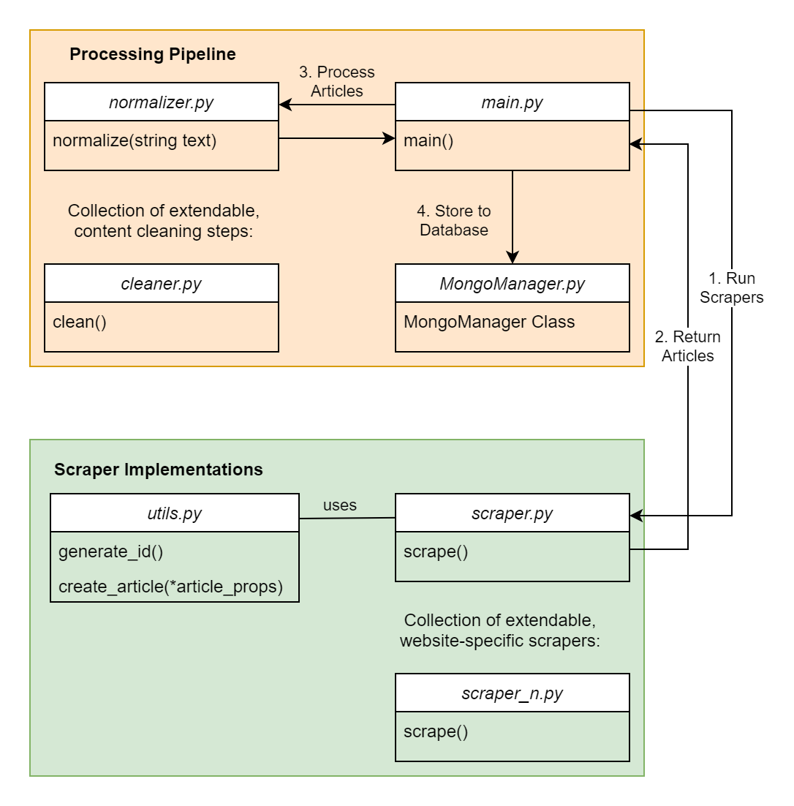

Scraper Pipeline
================

Nowadays, RSS feeds are ubiquitous on any news website.
These feeds include a list of news articles formatted as an XML file.
The scrapers listed here access these lists and parse them with `Feedparser <https://github.com/kurtmckee/feedparser>`_.
For the purpose of, e.g., news recommendations, the extracted information from these includes attributes such as URL, title, image, and lead.
The remainder of this page outlines how the sample scrapers work and interface with the remainder of the back end.

.. note::

   The scripts for the content scrapers can run on the same server as, or a different server from, the remainder of the Informfully back end.
   Running the scripts is not controlled by any element of the back end.
   There is no dedicated deployment step involved.
   Instead, the scrapers need to be part of a `cron job` running on the server.
   Communication with the other components of the back end is limited to writing items to the pre-defined document collection.

.. _modules:

Architecture Overview
---------------------

Informfully is complemented by a dedicated content scraper.
The entire content scraper pipeline is written in Python and uses MongoDB for persistent storage of news items.
All you need to do is add a scraper to `the scraper package <https://github.com/Informfully/Scrapers/tree/main/scraperpackage/scrapers>`_ and call it in ``main.py``.
You can also find sample implementations in this folder.

The individual scraper modules (called ``scrape.py`` or ``scrape_n.py``) are required to implement the scraping function ``scrape()``.
The scraper consists of two main parts.
The first part contains the scraper implementations that enable the collection and scraping of online resources.
The second part is the processing pipeline for text normalization, cleaning, and subsequent steps before storing them in the database.

Despite the goal of the scrapers being the same for all outlets, the different formats, types of sources of information, and paywalls on news outlets rendered the task of having only one scraper very challenging
Hence, the decision was made to have split scrapers, where one part consists of shared core functionalities for parsing HTML, and the second part consists of adjusting to particular news outlets.
Specifically, the scrapers for each outlet consist of two parts.
First, they obtain a list of the most recent articles, which includes either URLs or an identifier for the API.
Second, they iterate through the list and obtain the necessary information by scraping the HTML page or, if possible, directly accessing the API.

.. _structure:

File Structure
--------------

Splitting the scraping task into independent modules allows for source-specific scrapers.
The main program ``main.py`` will import all scraper modules and call their ``scrape()`` function, expecting them to return a list of items.
Functionalities shared among the scrapers are stored in a separate utility file (``utils.py``), such as a function to create an item object, which ensures uniformity in object field naming and default values.
Before storing the items in the document collections, the scraper performs a series of cleaning steps (e.g., duplication detection and text normalization).

The codebase includes a dedicated database manager.
This module simplifies establishing a connection to the MongoDB database.
It retrieves the credentials as well as the SSH connection details from the ``.env`` file.
To use the MongoManager, first import it with ``From mongomanager import MongoManager``.

Then use the with keyword to open the connection. MongoManager will return a MongoClient object.
If the configuration uses SSH, it will automatically close the connection once the with block is exited.
If it is configured without SSH, the manager will simply create a ``MongoClient`` object with the given address.

.. code-block:: python

   with MongoManager() as db:
      articles = db.articles.find({}).fetch()

.. _scraping:

Scraping Pipeline
-----------------

The system's scraper tool performs the following augmentation steps.
First, it optionally white-labels the news (i.e., removes any information pertaining to the source of the news article).
Second, the current pipeline automatically assigns an image to a news item if one is not provided (it does so based on the article's title and lead).
Third, the scraper performs text normalization (e.g., adjusting date and currency formatting) across all featured online sources.
Finally, for German and English, it runs a sentiment analysis, if available, that will generate additional flags for each article (flagging it as either expressing a negative or positive sentiment).
The following paragraphs provide a detailed explanation of each of these steps.

**HTML Parsing** The article content, i.e., the text itself, does not come with the feed.
The article text for each article is taken from an API.
When an API is unavailable, the content is scraped from the HTML page of the URL.
To obtain the HTML code from the URL, the built-in Python package `urllib <https://docs.python.org/3/library/urllib.html>`_ is used.
To simplify the process of extracting relevant information from an HTML page, `Beautiful Soup <https://www.crummy.com/software/BeautifulSoup>`_ is used to help parse the HTML content into an organized data tree, featuring built-in methods for navigation, searching, and modification.
When scraping, the system ensures that all the necessary fields are initialized with default values if the data cannot be obtained using the scraper.

**RSS Scraper** Within the small selection of scrapers, a few do not precisely follow the pattern of RSS feeds.
We provided a sample implementation for cases where the page's actual content is not directly included in the initial HTML data, i.e., whenever the content is dynamically loaded later on using JavaScript.
To automate this process, `Selenium <https:// www.selenium.dev>`_ along with `Geckodriver <https:// github.com/mozilla/geckodriver>`_ is used to open a browser, navigate to the URL, and execute the JavaScript to get a finalized page, from which the article list can be extracted using Beautiful Soup.
The scraping of individual articles follows the same procedure as other HTML-based scrapers. 
Naturally, scraping feeds takes more time than RSS feeds, as more processing is required to render a dynamic website.
After all articles have been scraped and are in a single list, the scraper will apply content preprocessing steps before writing them to the database.
The preprocessing steps are necessary to ensure that the articles are prepared in a state optimized for Informfully.
The mandatory preprocessing for articles currently consists of duplicate detection and text normalization.

**Duplication Detection** News outlets often take pre-written news articles from news agencies and publish them on their own websites.
When multiple news outlets publish the same article, both instances will be scraped and added to the database.
Both articles will be shown in the app, and because the name of the news outlet source is omitted, the user will see two virtually identical articles.
This is likely to be very confusing for the participant, so an additional step was required in the pipeline to detect and handle duplicate articles.
However, news outlets typically make minor adjustments to the original article content to fit their own format.
Therefore, a plain equality check on the entire article text will not work.
In our implementation, the two articles are first split into n-grams, sequences of words from the article text of a specific length.
Afterwards, a percentage is calculated for how many sentences are shared between the two articles.
If the percentage is over a certain threshold, the two articles will be considered duplicates.
Every new article from the scrapers will undergo this step.
The articles are compared with each other and with existing articles in the database.
Due to the time relevance of news articles, duplicates typically do not have a large time span between them, so the selection of articles from the database is limited by a time window of a few days.

**Text Normalization**. Especially when directly scraped from websites, news articles may contain idiosyncrasies such as spelling variants of words, formatting (including numbers, dates, and headlines), as well as self-references (names of the publication).
These anomalies may indicate the source of the article, which is undesirable.
The goal of the normalization step is to remove them to ensure a uniform presentation for the app.
The normalization process is implemented as a list of tuples.
The first element in the tuple is a regular expression to detect the abnormalities, with the second element being the string of text that serves as the replacement.

.. note::

  Please visit the `Item Entry <https://informfully.readthedocs.io/en/latest/items.html>`_ page to see how an item is represented in the database.
  We provide sample scrapers to help you create item entries that can be adapted for your specific use case.
  One example is the  `BBC Scraper <https://github.com/Informfully/Scrapers/blob/main/scraperpackage/scrapers/bbcscraper.py>`_ (see line 130).

.. _logging:

Logging Module
--------------

A logging module has been created to log any meaningful events happening during the scraping.
Every single log will contain a short message, the location where it was logged, a timestamp, and an ID that uniquely identifies a single execution run of the scrapers.
This logging tool is particularly useful for troubleshooting errors.
Any abnormalities in the scraper pipeline should be handled in a timely manner.
Especially during an ongoing experiment, it is vital that the flow of new articles is not halted.
In the event of a fatal error in the pipeline, the administrator is notified immediately via email with all relevant information.
With the run ID, other logs belonging to the same run can be queried from the database to get a timeline of events leading up to the error.
