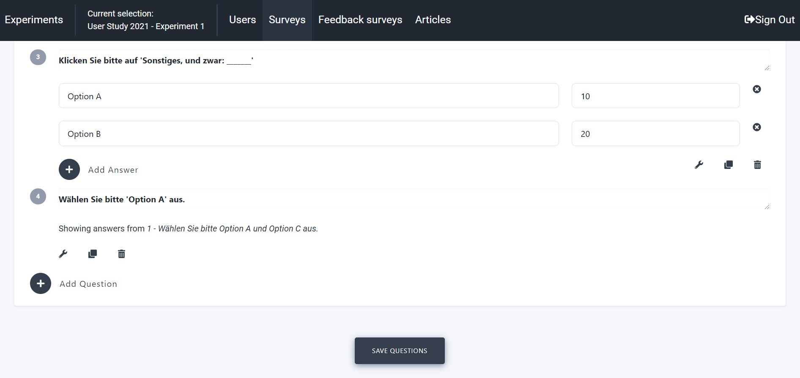
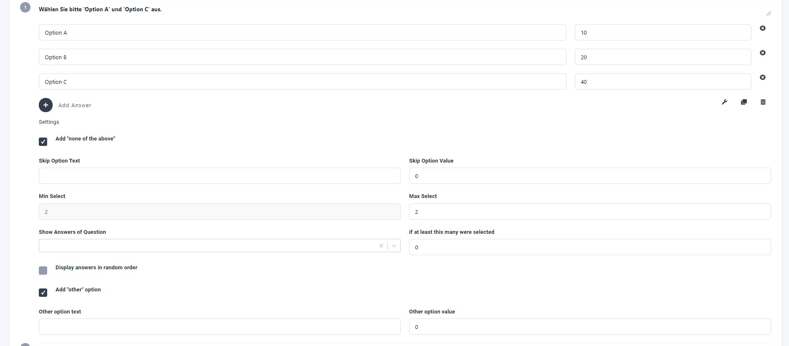

Survey Tool
===========

Informfully has a fully integrated tool for user surveys.
Below, you can find an overview of the features and functionalities of the survey editor.
Any survey created this way will be added to the currently selected experiment.
It is shown to all user groups within the experiment.

**Screenshot Activation**: Activating/deactivating a survey and deleting it is done via the activation button.
When the option is enabled, users will be prompted to complete the survey immediately.
They need to complete it in order to continue using the app.

.. image:: img/survey_screenshots/survey_1.jpg
   :width: 700
   :alt: Survey activation

**Screenshot Editor**: Adding questions and answers is done via the user interface.
There is no limit to how many questions can be added to a survey.
Similarly, there is no limit to how many pre-defined answers can be added to a question.

**Screenshot Questions**: Customizing questions, providing default answers/values for scripts to process, etc.
There is a range of different questions to choose from.
Free text, replies to previous questions, etc., can all be selected.

.. note::

    When creating surveys, every question is added to an experiment-specific question pool.
    This allows experimenters to reuse existing questions.
    When users answer the survey questions, the back end will store their answers together with a copy of the question string as well as the question ID.
    This allows experimenters to edit the question pool while still preserving the original question asked of the users when they want to evaluate the answers.

The surveys generated on this page are, by default, experiment-specific.
This means that all users within a given experiment will receive the same survey at the same point in time.
For use cases where there are group-specific surveys, we recommend creating two user experiments and then running them in parallel.
