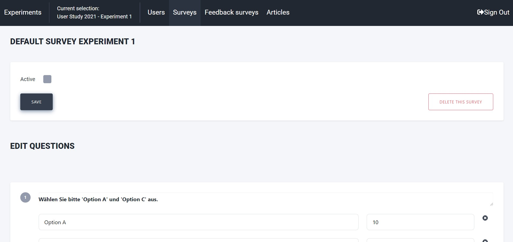

Survey Tool
===========

Below you can find a few screenshots outlining the features and functionalities of the survey editor of the administrator website.

**Screenshot Activation**: Activating/deactivating a survey and deleting it is done via the activation button.
When the option is enabled, users will be prompted the survey immediately.
They need to complete it in order to continue using the app.

**Screenshot Editor**: Adding questions and answers is done via the user interface.
There is no question/answer limite in place.

**Screenshot Questions**: Customizing questions, providing default answers/values for scripts to process etc.
There are a range of different questions to chose from.
Free text, replies from previous question etc. can all be selected.

The surveys generated on this page are by default experiment-specific.
This means that all users within a given experiment will receive the same survey at the same point in time.
For use cases where there are group-specific surveys, we recommend creating two user experiment and then run them in parallel.
